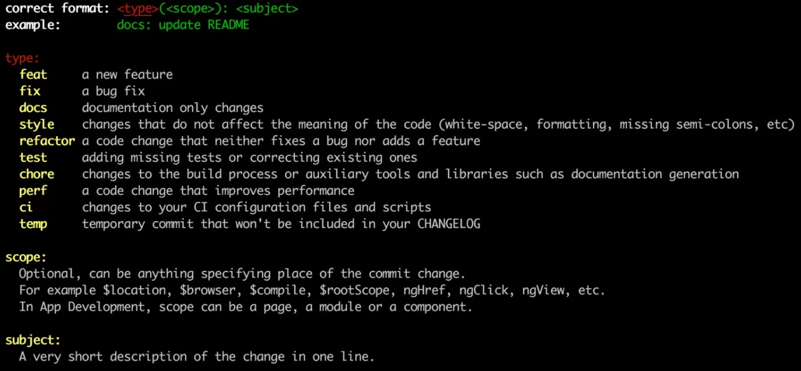

<h1 align="center">
    
    <br>
    Nike PDP
</h1>

<p align="center">
  <a href="#rocket-visão-geral">Visão geral</a>&nbsp;&nbsp;&nbsp;|&nbsp;&nbsp;&nbsp;
  <a href="#como-instalar">Como instalar</a>&nbsp;&nbsp;&nbsp;|&nbsp;&nbsp;&nbsp;
  <a href="#como-instalar-em-vtex-io">Como instalar em VTEX IO</a>&nbsp;&nbsp;&nbsp;|&nbsp;&nbsp;&nbsp;
  <a href="#padrões-de-código">Padrões de código</a>&nbsp;&nbsp;&nbsp;|&nbsp;&nbsp;&nbsp;
</p>

# :rocket: Visão Geral

Este sistema utiliza a API do [Via Cep](https://viacep.com.br/) para buscar dados sobre um número de CEP inserido.

## Acesse online

- https://patrickgratao.github.io/nike-pdp/

## Desktop


## Mobile


# Como instalar?

## Requisitos Mínimos

1.  Necessário ter no mínimo o node `14.x`

## Instalação

1.  Baixe ou clone este repositório
2.  Acesse a pasta baixada e instale as dependências com `npm install` ou `yarn install`
3.  Rode o comando `yarn start`

# Como instalar em VTEX IO

Para utilizar um serviço parecido com este dentro de uma loja VTEX IO devemos fazer o seguinte:

### 1. Declarar o bloco no arquivo `interfaces.json`

Dentro deste arquivo devemos declarar o bloco com o componente que iremos utilizar. 

Exemplo:

```json
"nike-pdp": {
    "component": "NikePDP"
  }
```

### 2. Criar o arquivo `NikePDP` na pasta `react`

Devemos criar o arquivo NikePDP dentro da pasta react.

O caminho ficaria: `react/NikePDP.tsx`

### 3. Escrever código no arquivo `react/NikePDP.tsx`

Exemplo: 

```typescript
import NikePDP from "./components/NikePDP";

export default NikePDP;

```

### 4. Criar a pasta `NikePDP` dentro da pasta `react/components`

Dentro da pasta NikePDP iremos colocar os códigos deste app. 

### 5. Chamar o bloco criado em `interfaces.json` onde precisar

Agora podemos utilizar o "snippet" `nike-pdp` em qualquer parte da loja VTEX IO.

Ao utilizar o snippet este aplicativo será renderizado.

## Mensagens de Commits

Para commits e branchs estamos utilizando o [Conventional Commits](https://www.conventionalcommits.org/pt-br/v1.0.0/) que é composto por três partes.

- Tipo (type) - Obrigatório
- Escopo (scope) - Opcional
- Assunto (subject) - Obrigatório



Exemplos:

| Problema que resolve                   | Mensagem de commit            |
| -------------------------------------- | ----------------------------- |
| Criar novo slider                      | `feat: create new slider`     |
| Corrigir bug no product summary        | `fix: bug in product summary` |
| Refatorar código do slider da homepage | `refactor: homepage slider`   |

## Branchs

As branchs devem ser descritas de acordo com o problema que resolve.

Exemplos:

| Problema que resolve                   | Nome da Branch             |
| -------------------------------------- | -------------------------- |
| Criar novo slider                      | `feat/create-new-slider`   |
| Corrigir bug no product summary        | `fix/bug-product-summary`  |
| Refatorar código do slider da homepage | `refactor/homepage-slider` |


---

Feito com 💗 por [Patrick Gratão](https://linkedin.com/in/patrickgratao/)
